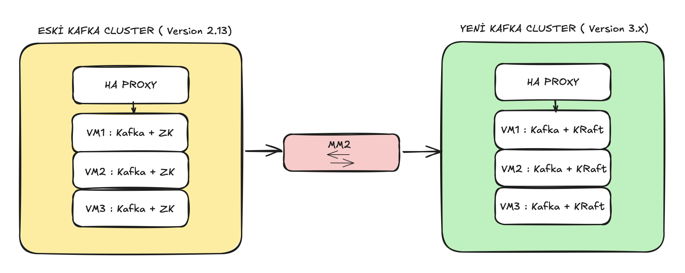

# DevOps Core Case

Bu repository, **DevOps Core Case** çalışmasının uygulama ve dokümantasyonunu içermektedir.  

Case iki ana bölümden oluşmaktadır:

1. **Kubernetes Cluster + Monitoring & Alerting (Prometheus Stack) + ArgoCD GitOps yapısı**
2. **Kafka Cluster Taşıma Stratejisi (Zero Downtime)**

---

## 📍 İçindekiler
- [Bölüm 1 – Kubernetes + Monitoring + ArgoCD](#-bölüm-1--kubernetes--monitoring--argocd)
  - [1. Kubernetes Kurulumu](#1-kubernetes-kurulumu)
  - [2. Cilium CNI Kurulumu](#2-cilium-cni-kurulumu)
  - [3. Worker Node Join](#3-worker-node-join)
  - [4. Ingress Controller Kurulumu](#4-ingress-controller-kurulumu)
  - [5. ArgoCD Kurulumu](#5-argocd-kurulumu)
  - [6. App-of-Apps Yapısı](#6-app-of-apps-yapısı)
  - [7. Prometheus Stack Kurulumu ve Alert Tanımları](#7-prometheus-stack-kurulumu)
- [Bölüm 2 – Kafka Taşıma Stratejisi](#-bölüm-2--kafka-taşıma-stratejisi)
- [📂 Repository Yapısı](#-repository-yapısı)

---

## 🚀 Bölüm 1 – Kubernetes + Monitoring + ArgoCD

### 1. Kubernetes Kurulumu
- **Versiyon:** Kubernetes `1.32.8` seçildi. En güncel versiyon yerine, **stabil ve bilinen hatası olmayan** bir sürüm tercih edildi.
- Control plane ve worker node IP'leri `/etc/hosts` dosyasına eklendi.
- `kubeadm` ile cluster init edildi ve pod network CIDR belirlendi.
- `containerd` CRI olarak yapılandırıldı.

📄 Detaylı kurulum adımları için: [docs/01-kubernetes-install.md](./docs/01-kubernetes-install.md)

---

### 2. Cilium CNI Kurulumu
- **Versiyon:** Cilium `1.17.4`, Kubernetes sürümü ile uyumlu olarak seçildi.
- `cilium-cli` ARM64 binary olarak indirildi.
- `ipam.mode=kubernetes` ile kurulum yapıldı.

📄 Detaylar: [docs/02-cilium-install.md](docs/02-cilium-install.md)

---

### 3. Worker Node Join
- Master node’da oluşturulan `kubeadm join` komutu ile worker node cluster’a eklendi.
- `kubectl get nodes` ile doğrulama yapıldı.

📄 Detaylar: [docs/03-worker-join.md](docs/03-worker-join.md)

---

### 4. Ingress Controller Kurulumu
- **Nginx Ingress Controller** Helm chart ile kuruldu.
- LoadBalancer tipi servis yerine **NodePort** kullanıldı.  
  **Sebep:** Ortam bir bulut sağlayıcısında değil, bu nedenle LoadBalancer tipi servis çalışmıyordu.

📄 Detaylar: [docs/04-ingresscontroller-install.md](docs/04-ingresscontroller-install.md)

---

### 5. ArgoCD Kurulumu
- ArgoCD resmi manifest ile kuruldu.
- TLS için **self-signed sertifika** oluşturuldu.
- Ingress üzerinden `argocd.kubikolog.com` hostu ile erişim sağlandı.

📄 Detaylar: [docs/05-argocd-install.md](docs/05-argocd-install.md)  


---

### 6. App-of-Apps Yapısı
- ArgoCD’de **App-of-Apps pattern** kullanılarak tüm manifest’ler tek bir parent application üzerinden yönetildi.
- Alt uygulamalar:
  - Prometheus CRD’leri
  - Prometheus Stack
  - Monitoring Ingress
  - Alert tanımları

📄 Detaylar: [docs/06-argocd-app-of-app.md](docs/06-argocd-app-of-app.md)

---

### 7. Prometheus Stack Kurulumu ve Alert Tanımlamaları

#### 7.1 Prometheus Stack Kurulumu
- `kube-prometheus-stack` Helm chart ile ArgoCD üzerinden kuruldu.
- `values.yaml` içinde gereksiz bileşenler devre dışı bırakıldı.
- Grafana, Prometheus ve Alertmanager için ingress tanımlandı.

📄 Detaylar: [docs/07-prometheus-stack-install.md](docs/07-prometheus-stack-install.md)

#### 7.2  Alert Kuralları
- **Node Not Ready** (1 dk içinde ulaşılmazsa)
- **Pod Alerts** (CrashLoopBackOff, ImagePullBackOff vb. tüm failed pod durumları)
- **API Server Down** (1 dk erişilemezse)

📄 Detaylar: [manifests/alerts/](./manifests/alerts/)

---

## 📡 Bölüm 2 – Kafka Taşıma Stratejisi

Case’in ikinci bölümünde, mevcut bir Kafka cluster’ının **downtime olmadan yeni bir cluster’a taşınması** istenmektedir.

### 🎯 Hedef
- Mesaj kaybı olmadan taşıma
- Minimum kesinti süresi
- Geri dönüş planı (rollback) ile güvenli taşıma

### 🛠 Strateji
1. **Hazırlık**
   - Yeni Kafka cluster, eski cluster ile aynı topic & partition yapısında kurulur.
   - Metadata uyumu sağlanır.

2. **Veri Senkronizasyonu**
   - `MirrorMaker 2` ile **real-time replikasyon** başlatılır.
   - Topic offset’leri kontrol edilir.

3. **Trafik Yönlendirme**
   - Consumer’lar yeni cluster’a bağlanacak şekilde yapılandırılır.
   - Producer’lar kademeli olarak geçirilir.

4. **Eski Cluster’ın Devreden Çıkarılması**
   - Tüm trafik yeni cluster’a geçince replikasyon durdurulur.

5. **Rollback Planı**
   - Sorun durumunda connection string/DNS eski cluster’a yönlendirilir.

### 📊 İzleme
- Prometheus ile Kafka lag ve throughput metrikleri izlenir.
- Alert kuralları ile veri kaybı veya gecikme durumunda uyarı alınır.

📄 Detaylar: [docs/08-kafka-migration-strategy.md](docs/08-kafka-migration-strategy.md)

---

## 🖼 Architecture


---
## 📂 Repository Yapısı

```plaintext
devops-core-case/
│
├── docs/
│ ├── kubernetes-install.md
│ ├── cilium-install.md
│ ├── worker-join.md
│ ├── ingress-controller-install.md
│ ├── argocd-install.md
│ ├── argocd-app-of-apps.md
│ ├── prometheus-stack-install.md
│ ├── alerts.md
│ └── kafka-migration-strategy.md
│
├── manifests/
│ ├── app-of-app/
│ ├── alerts/
│ ├── monitoring-ingress/
│ └── prometheus-stack/
│
└── README.md
```