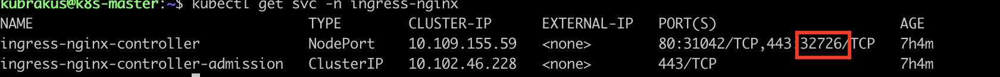

# 4️⃣ Ingress Controller Kurulumu (ingress-nginx)

Bu doküman, Kubernetes cluster’ına **NGINX Ingress Controller** kurulumunu anlatır.  
Kurulum **ARM64 mimarisi** üzerinde Helm kullanılarak yapılmıştır.

---

### 1. Helm Kurulumu (ARM64)

Helm, Kubernetes üzerinde uygulama paketlerini yönetmek için kullanılır.

```bash
# Helm binary indirilmesi (ARM64)
wget https://get.helm.sh/helm-v3.14.4-linux-arm64.tar.gz

# Tar'dan çıkarma
tar -zxvf helm-v3.14.4-linux-arm64.tar.gz

# Binary'i /usr/local/bin dizinine taşınması
sudo mv linux-arm64/helm /usr/local/bin/helm

# Helm versiyonunun kontrol edilmesi
helm version
```
### 2. Ingress Controller Kurulumu

NGINX Ingress Controller, Kubernetes üzerinde HTTP/HTTPS trafiğini yönlendirmek için kullanılır.
```bash
# ingress-nginx Helm repo ekleme
helm repo add ingress-nginx https://kubernetes.github.io/ingress-nginx
helm repo update

# ingress-nginx kurulumu
helm install ingress-nginx ingress-nginx/ingress-nginx \
  --namespace ingress-nginx \
  --create-namespace
```

### 3. Kurulum Kontrolleri

Kurulumun başarılı olduğunu doğrulamak için:
```bash
# Pod’ların çalıştığını kontrol edilir
kubectl get pods -n ingress-nginx

# Servisleri kontrol edilir
kubectl get svc -n ingress-nginx
````


### 4. LoadBalancer’dan NodePort’a Geçiş

Bu ortam bulut sağlayıcısında olmadığı için Kubernetes’te `type: LoadBalancer` servis tipi çalışmıyor.
Bu yüzden Ingress Controller servisini `NodePort` olarak değiştirerek, cluster dışından erişim sağladık.

```bash
kubectl edit svc ingress-nginx-controller -n ingress-nginx
```
Açılan YAML’da:

`type: LoadBalancer >>>> type: NodePort` olacak şekilde değiştirilir.

Kaydettikten sonra tekrar kontrol ederek nodeport bilgisini öğrenebiliriz.



