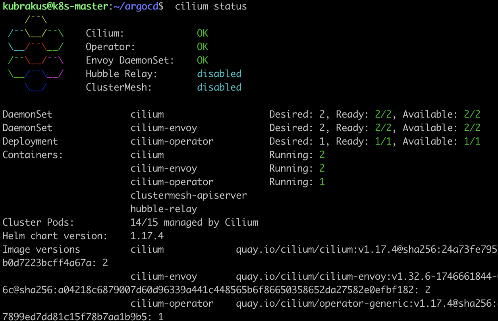
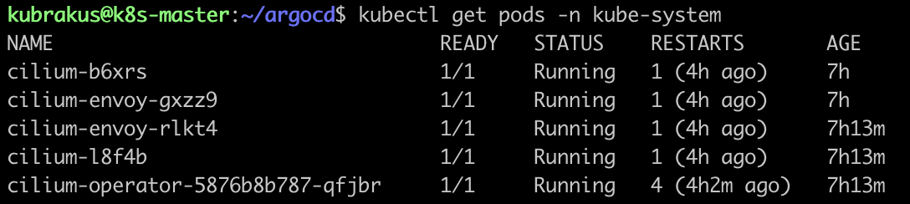

# 2️⃣ Cilium Kurulumu

### Cilium Nedir?

**Cilium**, Kubernetes ve Linux container ağları için **CNI (Container Network Interface)** eklentisidir.  
Geleneksel kube-proxy veya iptables tabanlı ağ yönlendirmelerinden farklı olarak **eBPF (Extended Berkeley Packet Filter)** teknolojisini kullanır.

### Başlıca Özellikler

- **Yüksek Performans:** eBPF sayesinde kernel seviyesinde paket işleme ile düşük gecikme.
- **Güvenlik Politikaları:** L3/L4 ve L7 seviyelerinde ağ politikaları tanımlama imkanı.
- **Service Mesh Desteği:** Sidecar gerektirmeden şeffaf servis mesh işlevselliği.
- **Gözlemlenebilirlik:** Ağ trafiği, bağlantılar ve güvenlik olaylarının izlenmesi.

## Bu Projede Kullanım Amacımız

- **Kubernetes Pod'ları arasında ağ iletişimini sağlamak.**
- **Kube-proxy’siz mod** ile daha verimli network yönetimi.
- **IPAM mode:** `kubernetes` seçilerek IP yönetimi Kubernetes tarafından yapılması.

### Kurulum Özet Adımları (ARM64)

Kurulum master sunucuda yapılmalıdır.

```bash
# Cilium CLI versiyonunun alınması
CILIUM_CLI_VERSION=$(curl -s https://raw.githubusercontent.com/cilium/cilium-cli/main/stable.txt)

# ARM64 binary indirilmesi
curl -L --remote-name-all \
  https://github.com/cilium/cilium-cli/releases/download/${CILIUM_CLI_VERSION}/cilium-linux-arm64.tar.gz{,.sha256sum}

# Dosyanın doğrulanmaı
sha256sum --check cilium-linux-arm64.tar.gz.sha256sum

# Paketin Kurulumu
sudo tar -C /usr/local/bin -xzvf cilium-linux-arm64.tar.gz
rm cilium-linux-arm64.tar.gz*

# Cilium CNI kurulumu
CILIUM_VERSION=1.17.4
cilium install --version v${CILIUM_VERSION} --set ipam.mode=kubernetes

# Durum kontrolü
cilium status
kubectl get pods -n kube-system
```




