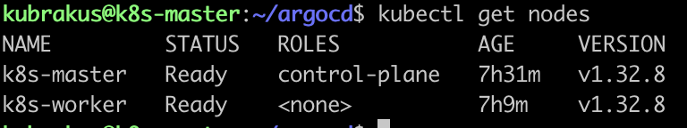

# 3️⃣ Worker Node'un Cluster'a Dahil Edilmesi

Kubernetes'te master (control-plane) node kurulumundan sonra, worker node'ların cluster'a eklenmesi gerekir.  
Bu işlem için **master node kurulumu sırasında** `kubeadm init` komutunun çıktısında verilen `kubeadm join` komutunu kullanırız.

### Adımlar

1. **Worker node üzerinde** (root yetkisi ile) aşağıdaki komutu çalıştırmamiz gerekiyor:

```bash
   kubeadm join 192.168.64.2:6443 --token <token> \
     --discovery-token-ca-cert-hash sha256:<hash>
````

2. **Token ve hash bilgileri:**

- Token: Master node kurulumu sırasında otomatik üretilir.
Token süresi 24 saat geçerlidir. Süresi dolarsa yeni token şu şekilde oluşturulabilir:

 ```bash
 kubeadm token create --print-join-command
 ```

- discovery-token-ca-cert-hash: Master node sertifikasının hash bilgisidir ve güvenli iletişim sağlar.

Komut başarıyla tamamlandığında worker node, cluster'a eklenmiş olur.

Master node üzerinde aşağıdaki komut ile yeni worker node'un geldiğini doğrulayabiliriz:

 ```bash 
kubectl get nodes
````
