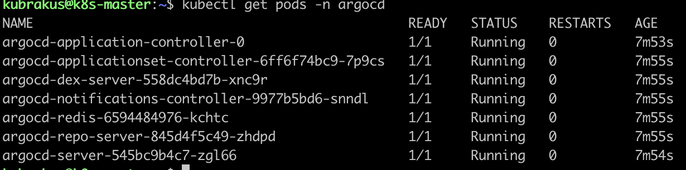
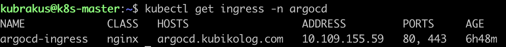
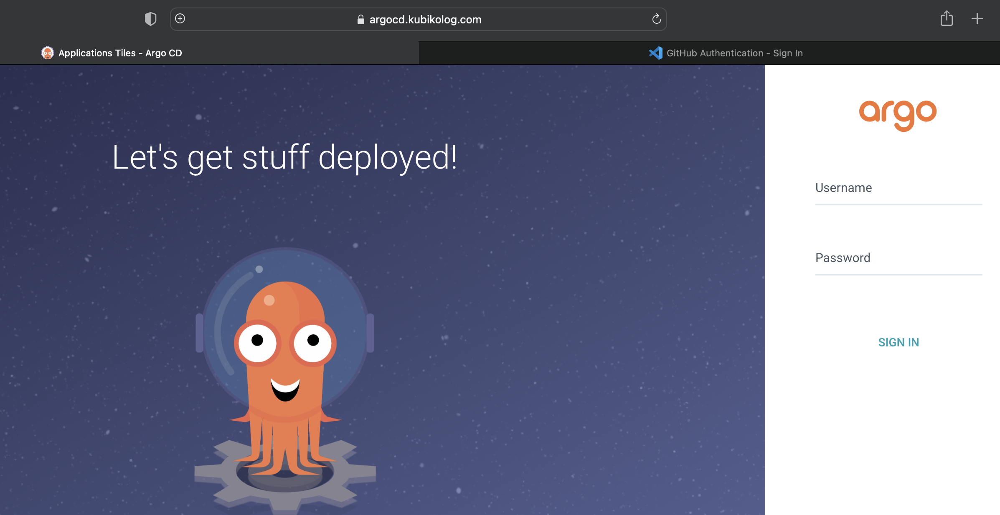

# 5️⃣ ArgoCD Kurulumu

Bu bölümde Kubernetes cluster üzerine ArgoCD kurulumu, TLS sertifikası oluşturma ve Ingress ile dış erişim yapılandırması adımları yer almaktadır.

### 1. Kurulum

ArgoCD için ayrı bir namespace oluşturuldu ve stable manifest kullanılarak kurulum yapıldı.
```bash
kubectl create namespace argocd
kubectl apply -n argocd -f https://raw.githubusercontent.com/argoproj/argo-cd/stable/manifests/install.yaml
```

Kurulumun ardından pod’ların durumunu kontrol edelim:
```bash
kubectl get pods -n argocd
````



### 2. ArgoCD Admin Şifresinin Alınması
Kurulum sonrası ArgoCD’nin admin kullanıcısı için başlangıç şifresi secret üzerinden çekildi.

```bash
kubectl get secret argocd-initial-admin-secret -n argocd \
  -o jsonpath="{.data.password}" | base64 -d
```

### 3. Sertifika Oluşturulması

Bu ortam tamamen lokal / test amaçlı olduğundan, Let's Encrypt gibi bir CA’dan (Certificate Authority) ücretsiz veya ücretli sertifika alma gereği yoktu.

Ayrıca ortamın cloud ortamında olmaması nedeniyle Let's Encrypt HTTP-01 doğrulaması yapılamayacağı için self-signed sertifika kullanmak en hızlı çözümdü.

**Not:** Self-signed sertifika, sadece tarayıcıda güvenlik uyarısı verir ancak HTTPS trafiğini şifreler.

Sertifika Oluşturma Komutu:

```bash
openssl req -x509 -nodes -days 365 \
  -newkey rsa:2048 \
  -keyout argocd.key \
  -out argocd.crt \
  -subj "/CN=argocd.kubikolog.com/O=argocd"
```

Kubernetes Secret Oluşturma:

```bash
kubectl -n argocd create secret tls argocd-tls \
  --cert=argocd.crt \
  --key=argocd.key
```

### 4. ArgoCD için Ingress Oluşturulması

argocd-ingress.yaml
```yaml
apiVersion: networking.k8s.io/v1
kind: Ingress
metadata:
  name: argocd-ingress
  namespace: argocd
  annotations:
    kubernetes.io/ingress.class: nginx
spec:
  ingressClassName: nginx
  tls:
    - hosts:
        - argocd.kubikolog.com
      secretName: argocd-tls
  rules:
    - host: argocd.kubikolog.com
      http:
        paths:
          - path: /
            pathType: Prefix
            backend:
              service:
                name: argocd-server
                port:
                  number: 443

```
Ingress oluşturma:

```bash
kubectl apply -f argocd-ingress.yaml
```

Kontrol:

```bash
kubectl get ingress -n argocd
```


**Not:** ingressClassName: nginx alanı belirtilerek Ingress kaynağının doğrudan ingress-nginx controller tarafından yönetilmesi sağlanmıştır.

Oluşturduğumuz ingress bilgisi ile erişim sağlamak için local bilgisayarın /etc/hosts dosyası içine aşağıdaki gibi IP-domain eşlemesi yapılır. Sonrasında tarayıcı üzerinden erişim test edilebilir.

`/etc/hosts` altına eklenecek satır:

```bash
192.168.64.2 argocd.kubikolog.com
```

Artık tarayıcıda şu şekilde erişebiliriz.

`https://argocd.kubikolog.com:32726``

