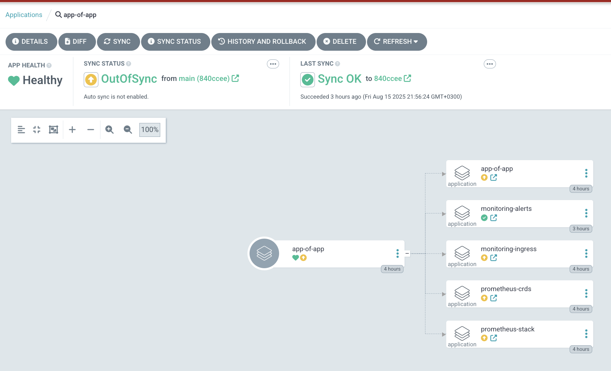
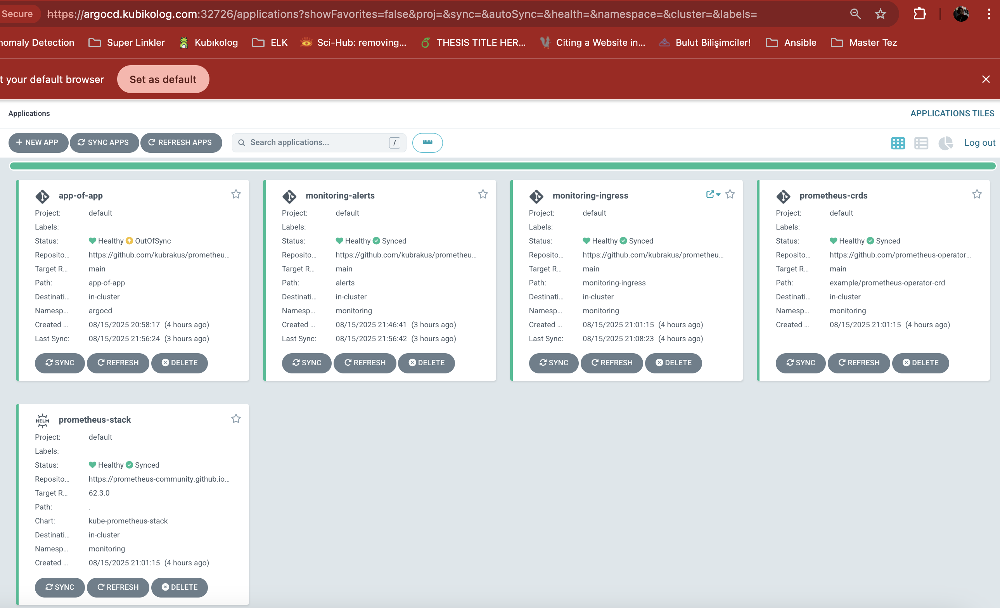

# 6️⃣ Argo CD – App-of-Apps Pattern

Tek bir root Application ile tüm alt uygulamaları (Prometheus Stack, Ingress, Alert kuralları, temizlik job’ı vb.) deklaratif ve sıralı biçimde deploy etmek amacıyla kullanılmıştır.

Tek manuel adım aşağıdaki `parent-app.yaml` dosyasının apply edilmesidir.

```yaml
apiVersion: argoproj.io/v1alpha1
kind: Application
metadata:
  name: app-of-app
  namespace: argocd
spec:
  project: default
  source:
    repoURL: https://github.com/kubrakus/prometheus-stack-repo.git
    targetRevision: main
    path: app-of-app
  destination:
    server: https://kubernetes.default.svc
    namespace: argocd
  syncPolicy: {}
#    automated:
#      prune: true
#      selfHeal: true
```

Apply komutu:

```bash
kubectl apply -f parent-app.yaml
```

Arayüze login olup application'ın ve applicationın kontrolündeki diğer applicationların kurulduğunu teyit edebiliriz.



