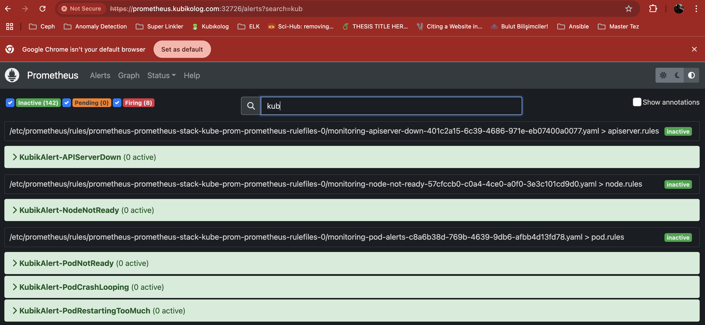

# 7️⃣ Prometheus Stack Kurulumu ve Alert Tanımları

Bu adım, case senaryosunda belirtilen:
1. Kubernetes cluster üzerinde **infrastructure monitoring** kurulumu
2. **Node ve servis metriklerinin izlenmesi**
3. **3 kritik alert kuralının tanımlanması**
maddelerinin yerine getirilmesi amacıyla hazırlanmıştır.

Kurulum, **GitOps** yaklaşımı ile **ArgoCD App-of-Apps** yapısı kullanılarak gerçekleştirilmiştir.

---

### 1. Kurulum Yöntemi

Prometheus Stack, manuel Helm komutları ile değil, **ArgoCD Application CRD** manifest’leri kullanılarak kurulmuştur.  
Bu yaklaşım, versiyon kontrol, tekrarlanabilir kurulum ve merkezi yönetim avantajı sağlar.

- `prometheus-community/kube-prometheus-stack` Helm chart’ı temel alınmıştır.
- İlgili Helm değerleri (`values.yaml`) repository’de versiyon kontrol altında tutulmuştur.
- Alert kuralları ayrı manifest dosyaları halinde oluşturulmuş ve Prometheus tarafından otomatik olarak yüklenmesi sağlanmıştır.
- İzleme bileşenlerine (Prometheus, Grafana, Alertmanager) dışarıdan erişim için **Ingress** tanımı yapılmıştır.

> **Not:** Bu kurulum, case’deki "node ve servis metriklerini izleme" ile "3 adet kritik alert tanımlama" gereksinimini karşılar.

---

#### Repo Yapısı
```plaintext
prometheus-stack-repo/
└── app-of-app/
│ ├── parent-app.yaml
│ ├── alerts-application.yaml
│ ├── monitoring-ingress-application.yaml
│ ├── prometheus-crd-application.yaml
│ └── prometheus-stack-application.yaml
└── monitoring-ingress/
│ └── monitoring-ingress.yaml
├── prometheus-stack/
│ └── values.yaml
├── alerts/
│ ├── node-not-ready.yaml
│ ├── pod-alerts.yaml
│ └── apiserver-down.yaml
└── monitoring-ingress.yaml
```

📂 Açıklamalar

app-of-app/ → ArgoCD’de "Application of Applications" yapısını sağlayan manifest’ler.

prometheus-stack/ → Helm chart values.yaml dosyası ve kurulum parametreleri.

alerts/ → 3 adet kritik alert kuralı (Node, Pod, API Server).

monitoring-ingress/ → Prometheus, Grafana ve Alertmanager’a erişim için Ingress tanımı.

---

### 2. Kurulum Adımları

***Adım 1 — CRD’lerin Yüklenmesi***

Prometheus Operator’un çalışabilmesi için gerekli CustomResourceDefinition’lar (`promentheus-crd-application.yaml`) deploy edildi.

***Adım 2 — Prometheus Stack Kurulumu***

Prometheus-stack-application.yaml ArgoCD Application manifest’i uygulanarak Prometheus Stack Helm chart’ı yüklendi.
Bu chart ile birlikte:

- Prometheus
- Grafana
- Alertmanager
- Node Exporter
- Kube State Metrics

bileşenleri otomatik kuruldu.

***Adım 3 — Alert Tanımlarının Eklenmesi***

3 adet kritik alert kuralı ayrı dosyalar halinde oluşturuldu:

**Node Not Ready →** 1 dakika boyunca node NotReady durumunda kalırsa tetiklenir.

Dosya: `alerts/node-not-ready.yaml`

**Pod Alerts →** Tüm pod’lar için genel sağlık kontrolleri.
Örneğin CrashLoopBackOff veya Pending durumları 1 dakikadan uzun sürerse alarm verir.

Dosya: `alerts/pod-alerts.yaml`

**API Server Down →** Kube API server erişilemezse 1 dakika içinde alarm verir.

Dosya: `alerts/apiserver-down.yaml`

***Adım 4 — İzleme Servislerine Erişim***

`monitoring-ingress.yaml` ile:

- Grafana → `grafana.kubikolog.com`
- Prometheus → `prometheus.kubikolog.com`
- Alertmanager → `alertmanager.kubikolog.com`
adresleri üzerinden HTTPS ile erişim sağlanmıştır.

Bu yapı sayesinde:

Kubernetes cluster’ındaki tüm kritik bileşenler izlenmekte,

Anlık problemler Alertmanager ile yakalanmakta,

Prometheus & Grafana arayüzlerinden geçmiş metrikler incelenebilmekte,

Tüm kurulum ve yapılandırma GitOps prensipleri ile ArgoCD üzerinden yönetilmektedir.

**Not:** Oluşturulan custom prometheus ruleların arayüzde görünür olabilmesi için aşağıdaki label alert yamllarına eklenmiştir.

```yaml  
labels:
    release: prometheus-stack
```



📌 İlgili Repository:
https://github.com/kubrakus/prometheus-stack-repo

