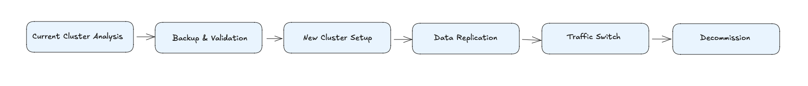

# Kafka Upgrade & Migration Strategy (Tek Site / 3 Node)

Bu bölüm, **tek veri merkezi (single site)** üzerinde kurulu, **3 node Kafka cluster** (her node üzerinde hem ZooKeeper hem de Kafka Broker çalışan) için; **sürüm yükseltme (upgrade)** , yani **yeni cluster’a geçiş (migration)** senaryosu ele alınmıştır.

Bu senaryo hazırlanırken;
- **Kesintiyi minimize etmek** (Zero/Minimal Downtime) , 
- **Veri kaybı olmaması** (Data Safety) , 
- **Performans artışı** , 
- **Geri dönüş (rollback) planı olması** göz önünde bulundurulmuş olup plan buna göre hazırlanmıştır. 

---

## 1) Mevcut Yapı

- **3 node cluster** → her node üzerinde **ZooKeeper + Broker**.  
- Kafka sürümü: **2.x** (Zookeeper tabanlı).  
- İş yükü: Kritik (finansal mesajlar, transaction log vb. olabilir).  
- Hedef: Kafka **3.7.x (KRaft mode)** gibi daha yeni, stabil bir sürüme geçmek.  

> **ZooKeeper** → Kafka’nın metadata (hangi topic hangi broker’da?) bilgisini tuttuğu harici servis. Kafka 2.x’te zorunlu.  
> **KRaft (Kafka Raft Metadata Mode)** → Kafka 3.x ile gelen yeni mod. ZooKeeper’a gerek kalmadan metadata Kafka’nın içinde tutuluyor. Daha basit ve güvenli.  

---

## 2) Hedefler

1. **Veri Güvenliği:**  
   - Hiç veri kaybı olmayacak (RPO ≈ 0).  
   - Minimum 2 kopya (ISR = In-Sync Replica) her zaman güncel kalacak.  

2. **Kesinti Süresi:**  
   - Upgrade sırasında **uygulamalar yazmaya/okumaya devam etmeli**.  
   - Kesinti sadece birkaç dakika (cutover anında) olabilir.  

3. **Performans:**  
   - Daha yüksek throughput (mesaj/saniye).  
   - Daha az latency (gecikme).  

4. **Geri Dönüş (Rollback):**  
   - Yeni cluster’da sorun çıkarsa DNS/konfigürasyon değişikliğiyle **eski cluster’a dönüş mümkün olmalı**.  

---

## 3) Neden Yeni Cluster Kurmak Daha Mantıklı?

İki yol var:  
- **In-place Rolling Upgrade** → Mevcut cluster node’larını tek tek güncellemek.  
- **Parallel Migration (Blue/Green)** → Yanında yeni cluster kurmak, veri replikasyonu yapmak, sonra trafiği yeni cluster’a yönlendirmek.  

|Koşullarımız | In-place Rolling | Parallel Migration |
|---------|-----------------|--------------------|
| Downtime | Düşük ama riskli | Sıfıra yakın |
| Risk | Hata çıkarsa geri dönüş zor | Geri dönüş kolay |
| Versiyon Atlama (2.x → 3.x, ZK → KRaft) | Çok karmaşık | Daha temiz |
| Operasyonel Yük | Mevcut cluster etkilenir | Yeni cluster üzerinde hazırlık yapılır |

👉 **Seçimim:** Parallel Migration (Blue/Green) + **MirrorMaker2** ile replikasyon.  


> **MirrorMaker2 (MM2):** Kafka’nın veriyi bir cluster’dan başka bir cluster’a kopyalayan (replicate eden) aracı servis.  

---

## 4) Geçiş Planı



---

### 4.1 Mevcut Cluster Analizi

- **Topic/partition dağılımı:** Hangi topic kaç partition’a sahip?  
- **ISR (In-Sync Replicas):** Replikalar güncel mi?  
- **Hot broker var mı?** (Bazı broker’lar fazla yük altında mı?)  
- **Consumer lag:** Tüketiciler mesajları zamanında alabiliyor mu?  

```bash
# Topic ve partition detayları
kafka-topics.sh --describe --bootstrap-server <broker:9092>

# Consumer lag
kafka-consumer-groups.sh --bootstrap-server <broker:9092> \
  --group <group> --describe
```

---

### 4.2 Backup & Validation

- **Metadata yedeği:**  
  - ZooKeeper snapshot alınır.  
- **Veri yedeği:**  
  - Disk snapshot veya seçili topic’lerin log arşivi.  
- **Geri yükleme testi:**  
  - Staging ortamında “geri dönüş” senaryosu test edilir.  

---

### 4.3 Yeni Cluster Kurulumu

- 3 node VM  
- **KRaft mode** ile kurulacak (ZooKeeper ihtiyacı olmayacak).  
- **Replication Factor (RF) ≥ 3** → her mesaj 3 node’a yazılmalı.  
- **min.insync.replicas ≥ 2** → en az 2 kopya yazılmadan mesaj başarılı sayılmamalı.  

**Örnek broker konfig:**

```properties
process.roles=broker,controller
node.id=1
controller.quorum.voters=1@node1:9093,2@node2:9093,3@node3:9093
listeners=PLAINTEXT://:9092,CONTROLLER://:9093
inter.broker.listener.name=PLAINTEXT
log.dirs=/kafka-logs
num.partitions=8
min.insync.replicas=2
unclean.leader.election.enable=false
```

---

### 4.4 Veri Replikasyonu (Eski → Yeni)

**MirrorMaker2**, ayrı bir VM üzerinde kurulur. Bu VM hem eski cluster’ın LB adresine hem yeni cluster’ın LB adresine bağlanır.

**MirrorMaker2** ile sürekli replikasyon başlatılır;  
- MM2 geçmişte yazılmış olan mesajları **baştan sona kopyalar** (tüm log segmentlerini).  
- Aynı zamanda, sync devam ederken yeni gelen mesajları da **gerçek zamanlı** taşır.  
- Böylece **hem geçmiş hem anlık veri** yeni cluster’a aktarılır.  

**MM2 Config örneği:**

```properties
clusters=OLD,NEW
OLD.bootstrap.servers=old-lb:9092
NEW.bootstrap.servers=new-lb:9092
OLD->NEW.enabled=true
topics=.*
groups=.*
replication.policy.class=org.apache.kafka.connect.mirror.DefaultReplicationPolicy

```

---

### 4.5 Trafiği Yeni Cluster’a Yönlendirme (Cutover)

- **Değişiklik dondurma** başlar.  
- **Kademeli geçiş:**  
  1. Canary uygulama → yeni cluster.  
  2. Trafiğin %10’u → %50’si → %100’ü.  
- DNS/Config değişikliği ile tüm uygulamalar yeni cluster’a bağlanır.  
- İzleme:  
  - `UnderReplicatedPartitions=0`  
  - Consumer lag normal  

---

### 4.6 Eski Cluster’ın Kapatılması (Decommission)

- Yeni cluster senkron ise eski cluster’da yazma durdurulur.  
- Son tutarlılık kontrolü yapılır.  
- Eski broker’lar kademeli kapatılır.  
- Arşiv yedeği alınır.  

---

## 5) Monitoring & Alerting

Önemli metrikler:  
- `UnderReplicatedPartitions > 0` → Alarm  
- `OfflinePartitionsCount > 0` → Alarm  
- Disk doluluk > %85 → Alarm  
- Consumer lag artışı → Alarm  

---

## 6) Rollback Planı

- DNS’i tekrar eski cluster’a yönlendir.  
- Yeni cluster’da üreticileri/dinleyicileri durdur.  
- MirrorMaker2 durdurulur (gerekirse NEW → OLD senkron başlatılabilir).  
- Hata kök nedeni araştırılır.  

---


